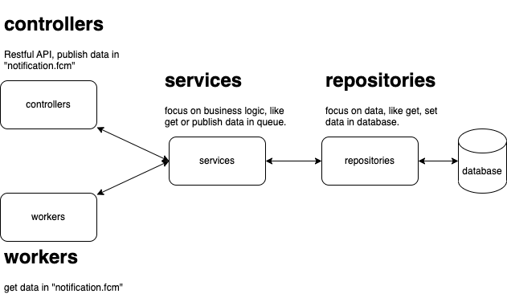

# Off-site Test

## 1. Env Setup
1. cp .env.example .env
2. set variable in .env file, specially FIREBASE_PROJECT_ID.( if you want to use own key file )
3. add firebase service account key in root of project as name `test-firebase-account-key.json`( if you want to use own key file )

## 2. Run docker-compose
```shell
make run
```

## 3. Migration
```shell
make migrate
```

## RabbitMQ
when server is running, you can open the url `http://localhost:15672/` in browser.

## Architecture
```
.
└── consume-fcm/
    ├── cmd/
    │   └── server/
    │       └── main.go
    ├── internal/
    │   ├── controllers/
    │   │   └── queue.go
    │   ├── models/
    │   │   └── fcm_job.go
    │   ├── pkg/
    │   │   ├── database.go
    │   │   ├── firebase.go
    │   │   └── message_queue.go
    │   ├── repositories/
    │   │   └── fcm_job.go
    │   ├── services/
    │   │   └── queue.go
    │   └── workers/
    │       └── queue
    └── migrations/
        └── ...
```

## flow chart
